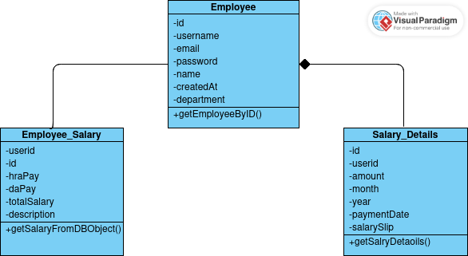
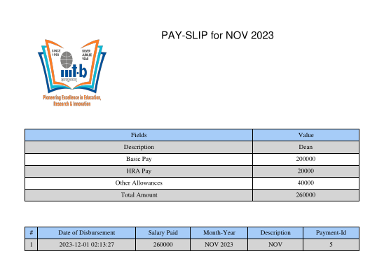

# Academic ERP

## Description
This project is a comprehensive Academic ERP (Enterprise Resource Planning) system designed to manage various aspects of academic institutions, including student management, course management, faculty management, human resources, accounts, hostel management, alumni, and placement services.

## Project Scope
The Academic ERP covers a wide range of functionalities tailored to the needs of academic institutions, making it a substantial and essential tool for managing day-to-day operations efficiently.

## Faculty View Salary History Module

### Description
The "Faculty View Salary History" module allows faculty members to access and review their salary information, providing transparency and convenience. Faculty members can view detailed salary history and download salary slips for specific months.

### Functionality
- **Secure Login**: Faculty members can log in securely to access their salary information.
- **Detailed Salary History**: Provides comprehensive details of past salary disbursements.
- **Downloadable Salary Slips**: Allows faculty members to download salary slips for specific months.
- **User-Friendly Interface**: Offers an intuitive interface for easy navigation and access to salary information.

## Technologies Used
- **Frontend**: React.js
- **Backend**: Spring Boot
- **Database**: [Specify your database here, e.g., MySQL, PostgreSQL]

## Usage
1. **Login**: Faculty members need to log in to the system using their credentials.
2. **Access Salary History**: Once logged in, faculty members can navigate to the "Salary History" section within their dashboard.
3. **View Salary Details**: In the "Salary History" section, faculty members can view details such as the amount disbursed, date of disbursement, and any additional notes or remarks related to their salary.
4. **Download Salary Slip**: Faculty members can download their salary slip for a specific month by selecting the desired month from the available options and clicking the "Download" button.

## Frontend Startup Steps (React.js)
1. Clone the repository: `git clone [repository_url]`
2. Navigate to the frontend directory: `cd frontend`
3. Install dependencies: `npm install`
4. Start the development server: `npm start`
5. Access the application in your browser at `http://localhost:3000`

## Backend Startup Steps (Spring Boot)
1. Clone the repository: `git clone [repository_url]`
2. Navigate to the backend directory: `cd backend`
3. Import the project into your preferred IDE (e.g., IntelliJ IDEA, Eclipse)
4. Configure database settings in `application.properties` file
5. Build and run the Spring Boot application
6. The backend server will start at `http://localhost:8080`

## Features
- **Secure Login**: Faculty members can securely log in to their accounts using their unique credentials.
- **Comprehensive Salary History**: The system provides a comprehensive overview of faculty members' salary history, including details of all past disbursements.
- **Downloadable Salary Slips**: Faculty members have the option to download their salary slips for specific months in a downloadable format (e.g., PDF) for record-keeping or reference purposes.

## Class Diagram

## Payment Slip Screenshot

## ERP-Project

## Contributors
Vraj Jatin Naik

